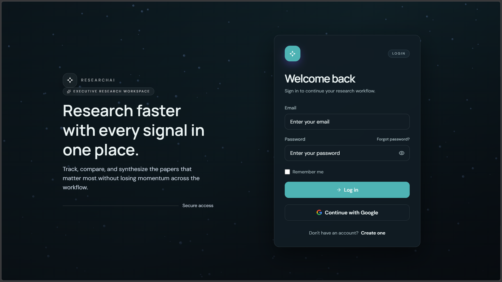
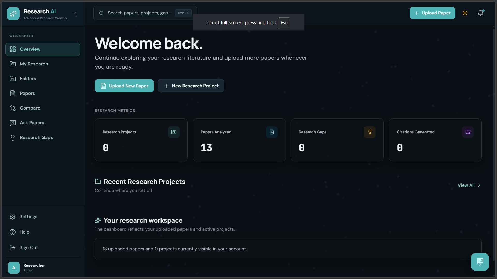
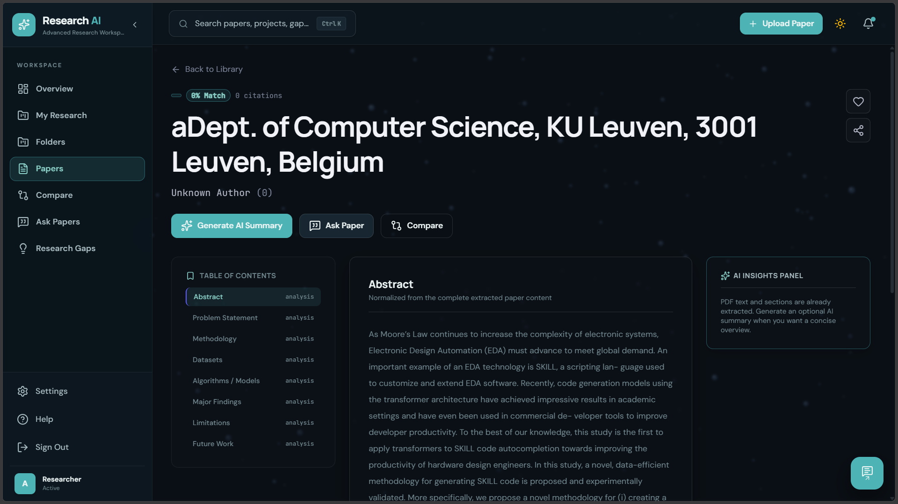
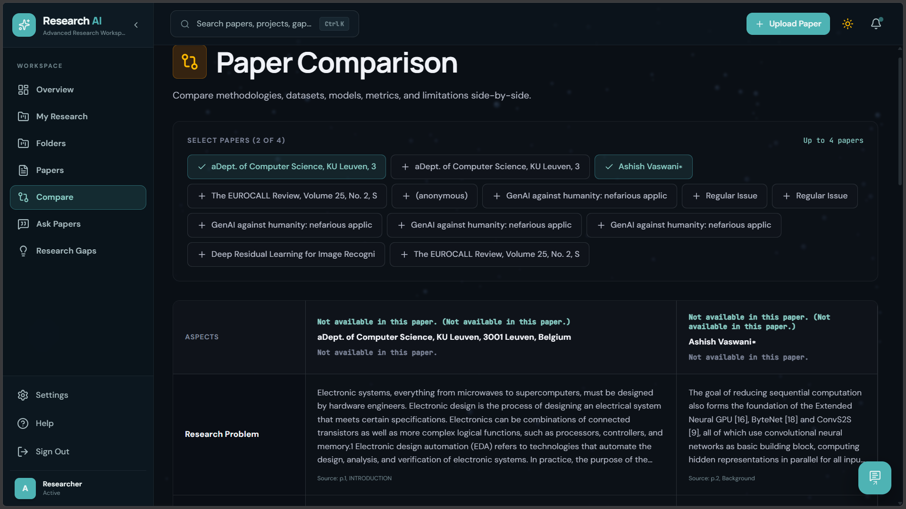
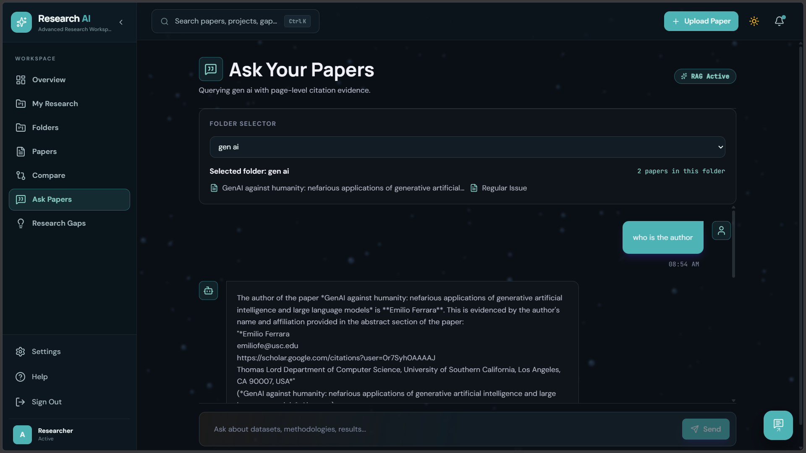
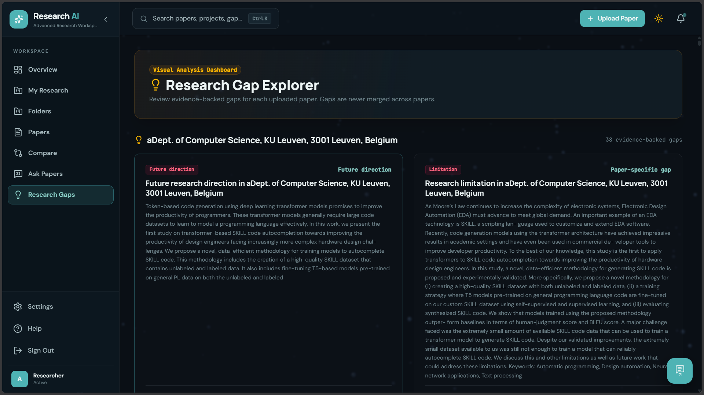

# 📚 ResearchAI

### Research Paper Summarizer and Literature Assistant

An AI-powered web app that turns a stack of research paper PDFs into structured summaries, evidence-backed answers, side-by-side comparisons and research-gap suggestions, with **page-level citations** on every claim.

🔗 **Live Demo:** [researchai-app.vercel.app](https://researchai-app.vercel.app/)


---

## 📖 Overview

A literature review can mean reading and comparing 15–20 papers, each 10–30 pages long, just to extract the problem, method, dataset, results and limitations of every one. **ResearchAI** reduces that effort.

Upload your papers, and ResearchAI parses them, detects their sections, and uses a **Retrieval-Augmented Generation (RAG)** pipeline to produce answers that are grounded in your own documents, not in the LLM's general memory. This keeps hallucination low and every claim verifiable.

## ✨ Features

| Feature | Description |
| --- | --- |
| **Multi-PDF Upload** | Drag-and-drop upload (up to 50 MB per file) with automatic text, section and page-metadata extraction. |
| **Structured Summaries** | Section-wise output: Abstract, Problem Statement, Methodology, Datasets, Algorithms/Models, Major Findings, Limitations, Future Work. |
| **Ask Your Papers** | Natural-language Q&A across a folder of papers, with page-cited answers and a "RAG Active" indicator. |
| **Multi-Paper Comparison** | Compare up to 4 papers side by side on problem, methodology, dataset and results, each traced to its source page. |
| **Research Gap Explorer** | Evidence-backed "limitation" and "future direction" cards to spot under-explored areas. |
| **Folders / Projects** | Organise papers into collections and scope questions and comparisons to a topic. |
| **Citation Generator** | Ready-to-use citations in APA, IEEE, MLA, Chicago and BibTeX. |
| **ResearchAI Copilot** | In-app assistant that guides new users through the platform. |
| **Secure Auth** | Email/password and Google login via Supabase Auth, with per-user data isolation. |

## 🧠 How It Works

```
PDF Upload → Text & Section Extraction (PyMuPDF) → Semantic Chunking
          → Embeddings → Vector Store (PostgreSQL + pgvector)
          → Semantic Retrieval → LLM Answer / Summary → Page-level Citations
```

1. **Extract:** PyMuPDF pulls text, page numbers and section structure from each PDF.
2. **Chunk and embed:** Content is split into semantic chunks and converted to vector embeddings.
3. **Store:** Embeddings are saved in PostgreSQL using the `pgvector` extension.
4. **Retrieve:** A query pulls the most relevant chunks via similarity search.
5. **Generate:** The LLM answers using *only* the retrieved evidence, attaching the source page and section.

## 🏗️ Architecture

ResearchAI uses a layered client–server architecture:

- **Frontend:** React 19 SPA (TypeScript, Vite, Tailwind CSS) in the browser
- **Backend:** FastAPI REST API, split into PDF, AI/RAG and summary-generation services
- **Data layer:** PostgreSQL + pgvector, with Supabase for authentication and file storage

## 🛠️ Tech Stack

**Frontend**
React 19 · TypeScript · Vite · Tailwind CSS · Framer Motion · React Router · Lucide React · Supabase JS client

**Backend**
Python · FastAPI · Uvicorn · Pydantic / pydantic-settings · PyMuPDF · python-multipart · Supabase Python SDK

**Database & Storage**
PostgreSQL · pgvector · Supabase (Auth, Database, Storage)

**AI**
Embedding model + Large Language Model accessed via API (RAG pipeline)

**Testing & Tooling**
pytest · oxlint · Swagger UI (via FastAPI) · Git & GitHub

**Deployment**
Vercel (frontend) · cloud-hosted backend and database

## 🚀 Getting Started

### Prerequisites

- Node.js (LTS) and npm
- Python 3.x
- A Supabase project with the `pgvector` extension enabled
- API keys for your chosen embedding model and LLM provider

### 1. Clone the repository

```bash
git clone https://github.com/<your-username>/<your-repo>.git
cd <your-repo>
```

### 2. Backend setup

```bash
cd backend                      # adjust to your folder name
python -m venv venv
source venv/bin/activate        # Windows: venv\Scripts\activate
pip install -r requirements.txt

cp .env.example .env            # then fill in your keys (see below)

uvicorn main:app --reload       # adjust to your entry module
```

The API runs at `http://localhost:8000`, and interactive Swagger docs are at `http://localhost:8000/docs`.

### 3. Frontend setup

```bash
cd frontend                     # adjust to your folder name
npm install
npm run dev
```

The app runs at `http://localhost:5173`.

### 4. Environment variables

Copy `.env.example` to `.env` in each part of the project and fill in your values. Typical settings include:

```env
# Backend
SUPABASE_URL=your_supabase_project_url
SUPABASE_KEY=your_supabase_service_key
DATABASE_URL=your_postgres_connection_string
LLM_API_KEY=your_llm_api_key
EMBEDDING_API_KEY=your_embedding_api_key

# Frontend
VITE_SUPABASE_URL=your_supabase_project_url
VITE_SUPABASE_ANON_KEY=your_supabase_anon_key
VITE_API_URL=http://localhost:8000
```

> ⚠️ Never commit your `.env` file. Use `.env.example` to document required variables.

## 🧪 Running Tests

The backend test suite (pytest) covers summary generation, per-user data isolation and upload validation.

```bash
cd backend
pytest
```

| Test | Expected Result |
| --- | --- |
| Upload a valid text-based PDF | Accepted; text and sections extracted |
| Upload a non-PDF file | Rejected with a clear error |
| Upload a PDF over the size limit | Rejected with a file-size error |
| Generate a structured summary | All expected sections present |
| User A accesses User B's papers | Access denied |
| Ask a question with no relevant evidence | "No relevant evidence found" rather than a fabricated answer |

## 📸 Screenshots

> Add your screenshots to a `/screenshots` folder and update the paths below.

| Login | Dashboard |
| --- | --- |
|  |  |

| Paper Summary | Compare Papers |
| --- | --- |
|  |  |

| Ask Your Papers | Research Gap Explorer |
| --- | --- |
|  |  |

## ⚠️ Limitations

- Supports text-based (digitally native) PDFs only; scanned/image-only PDFs are not yet supported.
- Section detection can be imperfect for unusual or multi-column layouts.
- Requires an internet connection for the LLM, embedding API and Supabase.
- Research-gap suggestions are a starting point for human investigation, not a final judgement.

## 🔮 Future Scope

- [ ] OCR support for scanned papers
- [ ] Citation-network analysis and visualisation
- [ ] Cross-database search (Semantic Scholar, arXiv)
- [ ] Duplicate and similar-paper detection
- [ ] Collaborative, multi-user workspaces
- [ ] Companion mobile app


## 📚 References

- Lewis et al., *Retrieval-Augmented Generation for Knowledge-Intensive NLP Tasks*, NeurIPS 2020
- [pgvector](https://github.com/pgvector/pgvector) · [FastAPI](https://fastapi.tiangolo.com/) · [PyMuPDF](https://pymupdf.readthedocs.io/) · [Supabase](https://supabase.com/docs)

## 📄 License

This project was developed for academic purposes. Add a license of your choice (e.g., MIT) here.
